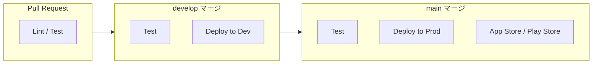

# デプロイ・CI/CD パイプライン

## 環境構成

### 環境一覧

| 環境 | 用途 | Firebase Project | Branch |
|------|------|-----------------|--------|
| local | ローカル開発 | エミュレータ | feature/* |
| development | 開発・テスト | mahjong-dev | develop |
| production | 本番 | mahjong-prod | main |

### プロジェクト切り替え

```bash
# 開発環境
firebase use development

# 本番環境  
firebase use production
```

---

## デプロイ対象

### コンポーネント別

```
┌──────────────────────────────────────────────────────┐
│                    デプロイ対象                        │
├──────────────────────────────────────────────────────┤
│  Cloud Functions   │  firebase deploy --only functions  │
│  Firestore Rules   │  firebase deploy --only firestore  │
│  Firebase Hosting  │  firebase deploy --only hosting    │
│  App Store         │  flutter build ios → Transporter   │
│  Play Store        │  flutter build appbundle → Console │
└──────────────────────────────────────────────────────┘
```

---

## CI/CD パイプライン

### 全体フロー



### GitHub Actions ワークフロー

#### バックエンド CI/CD

```yaml
# .github/workflows/backend.yml
name: Backend CI/CD

on:
  push:
    branches: [main, develop]
    paths:
      - 'apps/backend/**'
      - 'packages/**'
  pull_request:
    branches: [main, develop]

jobs:
  test:
    runs-on: ubuntu-latest
    steps:
      - uses: actions/checkout@v4
      
      - uses: pnpm/action-setup@v2
        with:
          version: 8
          
      - uses: actions/setup-node@v4
        with:
          node-version: '20'
          cache: 'pnpm'
          
      - run: pnpm install
      - run: pnpm --filter @mahjong/shared-types build
      - run: pnpm --filter @mahjong/mahjong-core build
      - run: pnpm --filter @mahjong/backend test
      - run: pnpm --filter @mahjong/backend lint

  deploy-dev:
    needs: test
    if: github.ref == 'refs/heads/develop'
    runs-on: ubuntu-latest
    steps:
      - uses: actions/checkout@v4
      - uses: pnpm/action-setup@v2
      - uses: actions/setup-node@v4
      - run: pnpm install
      - run: pnpm --filter @mahjong/backend... build
      
      - uses: google-github-actions/auth@v1
        with:
          credentials_json: ${{ secrets.FIREBASE_SERVICE_ACCOUNT_DEV }}
          
      - run: |
          npm install -g firebase-tools
          firebase use development
          firebase deploy --only functions

  deploy-prod:
    needs: test
    if: github.ref == 'refs/heads/main'
    runs-on: ubuntu-latest
    environment: production
    steps:
      - uses: actions/checkout@v4
      - uses: pnpm/action-setup@v2
      - uses: actions/setup-node@v4
      - run: pnpm install
      - run: pnpm --filter @mahjong/backend... build
      
      - uses: google-github-actions/auth@v1
        with:
          credentials_json: ${{ secrets.FIREBASE_SERVICE_ACCOUNT_PROD }}
          
      - run: |
          npm install -g firebase-tools
          firebase use production
          firebase deploy --only functions
```

#### フロントエンド CI/CD (Web)

```yaml
# .github/workflows/frontend-web.yml
name: Frontend Web CI/CD

on:
  push:
    branches: [main, develop]
    paths:
      - 'apps/frontend/**'

jobs:
  build-and-deploy:
    runs-on: ubuntu-latest
    steps:
      - uses: actions/checkout@v4
      
      - uses: subosito/flutter-action@v2
        with:
          flutter-version: '3.16.0'
          
      - run: |
          cd apps/frontend
          flutter pub get
          flutter analyze
          flutter test
          
      - run: |
          cd apps/frontend
          flutter build web --release \
            --dart-define=API_URL=${{ vars.API_URL }}
            
      - uses: FirebaseExtended/action-hosting-deploy@v0
        with:
          repoToken: ${{ secrets.GITHUB_TOKEN }}
          firebaseServiceAccount: ${{ secrets.FIREBASE_SERVICE_ACCOUNT }}
          channelId: ${{ github.ref == 'refs/heads/main' && 'live' || 'preview' }}
```

---

## 手動デプロイ

### バックエンド

```bash
# 1. パッケージビルド
pnpm --filter @mahjong/backend... build

# 2. 環境選択
firebase use development  # or production

# 3. デプロイ
firebase deploy --only functions
```

### Firestore Rules

```bash
firebase deploy --only firestore:rules
firebase deploy --only firestore:indexes
```

### Flutter Web

```bash
cd apps/frontend

# ビルド
flutter build web --release

# デプロイ
firebase deploy --only hosting
```

### モバイルアプリ

#### iOS

```bash
cd apps/frontend

# ビルド
flutter build ios --release

# App Store Connect へアップロード
# Xcode → Product → Archive → Distribute App
```

#### Android

```bash
cd apps/frontend

# App Bundle ビルド
flutter build appbundle --release

# Play Console へアップロード
# 手動で aab ファイルをアップロード
```

---

## ロールバック

### Cloud Functions

```bash
# 関数バージョン一覧
gcloud functions versions list calculateScore --region=asia-northeast1

# 特定バージョンにロールバック
gcloud functions deploy calculateScore \
  --source=gs://bucket/previous-version.zip \
  --region=asia-northeast1
```

### Firebase Hosting

```bash
# リリース一覧
firebase hosting:releases:list

# ロールバック
firebase hosting:clone VERSION:live
```

---

## シークレット管理

### GitHub Secrets

| Secret | 用途 |
|--------|------|
| FIREBASE_SERVICE_ACCOUNT_DEV | 開発環境デプロイ用 |
| FIREBASE_SERVICE_ACCOUNT_PROD | 本番環境デプロイ用 |

### 環境変数

| Variable | 用途 |
|----------|------|
| API_URL | Flutter アプリの API 接続先 |
| FIREBASE_PROJECT_ID | Firebase プロジェクト ID |

---

## デプロイチェックリスト

### 本番デプロイ前

- [ ] すべてのテストが pass
- [ ] develop でリグレッションテスト実施
- [ ] セキュリティルールの確認
- [ ] API 互換性の確認
- [ ] ロールバック手順の確認

### デプロイ後

- [ ] ヘルスチェック確認
- [ ] 主要機能の動作確認
- [ ] エラーログ監視
- [ ] パフォーマンスメトリクス確認
