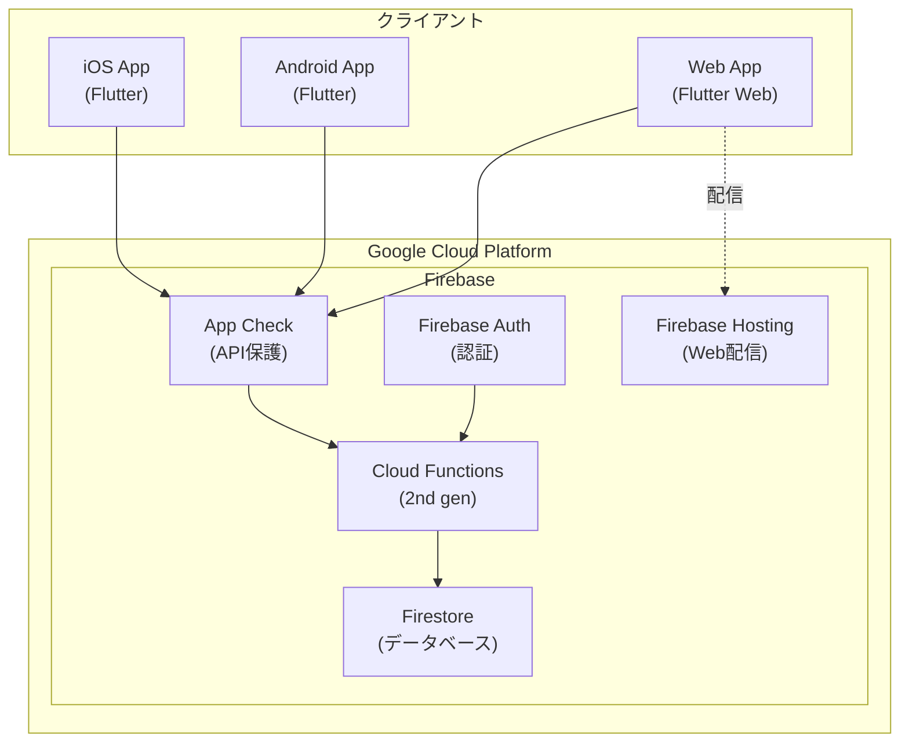

# インフラ構成概要

## システム構成図



## レイヤー構成

### 1. プレゼンテーション層

| コンポーネント | 詳細 |
|--------------|------|
| Flutter App | iOS / Android / Web 対応のクロスプラットフォームアプリ |
| Firebase SDK | クライアント側 Firebase 連携 |
| Riverpod | 状態管理 |

### 2. API層

| コンポーネント | 詳細 |
|--------------|------|
| Cloud Functions (2nd gen) | Node.js 20 ランタイム、TypeScript |
| Callable Functions | Firebase SDK 経由で呼び出し |
| Zod | リクエストバリデーション |

### 3. データ層

| コンポーネント | 詳細 |
|--------------|------|
| Firestore | NoSQL ドキュメントデータベース |
| Security Rules | 細粒度アクセス制御 |

### 4. セキュリティ層

| コンポーネント | 詳細 |
|--------------|------|
| App Check | アプリ正当性検証 (App Attest / Play Integrity) |
| Firebase Auth | ユーザー認証 |

## データフロー

### 点数計算フロー

```
1. ユーザーが手牌を入力
2. Flutter App が callable function 呼び出し
3. App Check トークンが自動付与
4. Cloud Functions がトークン検証
5. バリデーション実行 (Zod)
6. mahjong-core で点数計算
7. 結果を返却
8. (オプション) 履歴を Firestore に保存
```

### 履歴保存フロー

```
1. 計算結果画面で保存ボタンをタップ
2. Firebase Auth で認証状態確認
3. callable function 呼び出し
4. Firestore に履歴ドキュメント作成
5. 保存完了を返却
```

## 環境構成

| 環境 | 用途 | Firebase Project |
|------|------|-----------------|
| development | 開発・テスト | mahjong-dev |
| production | 本番 | mahjong-prod |

### 各環境の接続先

```
開発環境:
  - Functions: http://localhost:5001 (エミュレータ)
  - Firestore: http://localhost:8080 (エミュレータ)

本番環境:
  - Functions: https://asia-northeast1-{project}.cloudfunctions.net
  - Firestore: 本番インスタンス
```
